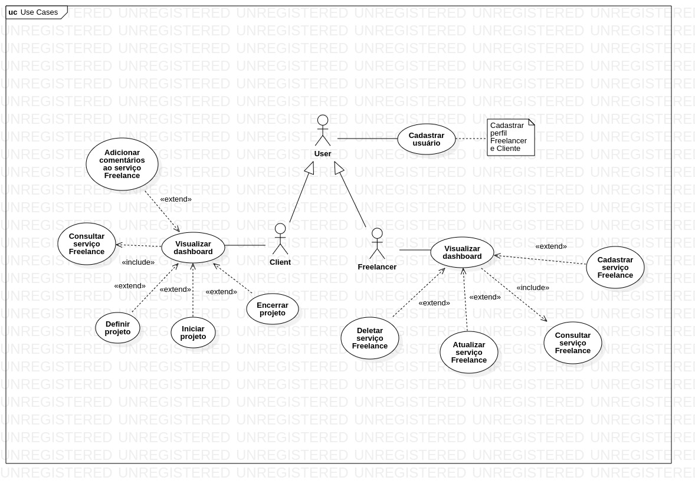

# O que é o DevFreela?

- Plataforma para cadastro e contratação de serviços de freelance de desenvolvedores, basicamente a aplicação vai ligar o cliente final aos freelancers.

# Qual o problema?

- Pela alta demanda de novos projetos no mercado de tecnologia, a necessidade de se delegar módulos ou projetos inteiros se torna cada vez mais comum.

# Modelando o domínio

- O DevFreela oferece uma plataforma unificada para **Clientes** contratarem os melhores **Freelancers** para seus **Projetos**, de maneira confiável e gerenciada.
- Os **Clientes** definem as características dos **Projetos** que publicam. Os **freelancers** se comunicam com eles a respeito do **Projeto**, e suas habilidades.
- Os **Clientes** iniciam o **Projeto** com um **Freelancer** que tenha um **Perfil** adequado ao **Projeto**, interagindo com ele até concluir o **Projeto**.

# Fluxo principal

- O **Cliente** publica uma oportunidade de projeto na plataforma, com título, descrição e outras informações.
- Um **Freelancer** encontra essa oportunidade, e troca mensagens com **Cliente**.
- Acertadas as condições, o **Cliente** seleciona o **Freelancer** como profissional escolhido, e inicia o projeto.

# Requisitos funcionais

## Freelancer

- **Freelancer** deve visualizar o dashboard principal.
- **Freelancer** deve consultar serviços Freelance.
- **Freelancer** pode cadastrar serviços Freelance.
- **Freelancer** pode atualizar serviços Freelance.
- **Freelancer** pode deletar serviços Freelance.

## Cliente

- **Cliente** deve visualizar o dashboard principal.
- **Cliente** pode adicionar comentários ao serviço Freelance.
- **Cliente** deve visualizar consultar serviços Freelance.
- **Cliente** pode definir um projeto.
- **Cliente** pode iniciar um projeto.
- **Cliente** pode finalizar um projeto.

## Usuário

- **Usuário** pode cadastrar novos usuários.

# Diagrama de caso de uso

# Tecnologias, padrões e arquiteturas
- ASP.NET Core com .NET 7;
- Arquitetura Limpa;
- Entity Framework Core;
- CQRS;
- Padrão Repository;
- Validação de API com FluentValidation;
- Autenticação e Autorização com JWT;
- Testes unitários com xUnit;
- Mensageria com RabbitMQ;